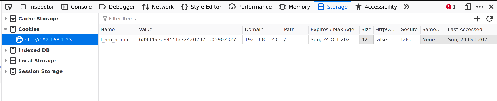
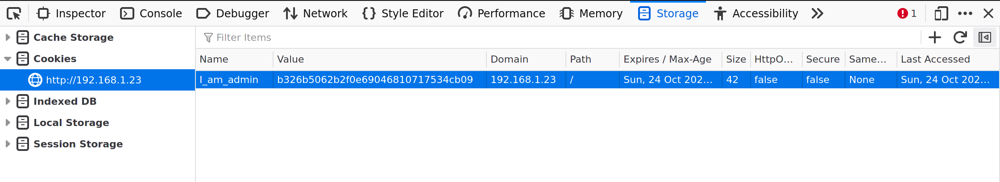
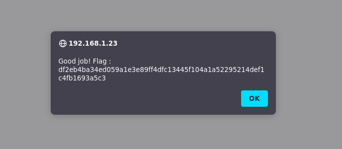

# Cookies

- Tags : `hash`, `md5`, `cookies`, `storage`
- Server ip : `192.168.1.23 `
- Difficulty : <span style="color : green">Easy</span>
___


# problem

For a long time webadministrator used [`browser cookies`](https://en.wikipedia.org/wiki/HTTP_cookie) to store many different information and states, including the login information and state. A cookie is generally created by the `server` and is stored in the users (clients) `browser` and during each `http` request the cookies are sent inside the [`http header`](https://developer.mozilla.org/en-US/docs/Web/HTTP/Headers). Cookies are helpfull in many ways but if badly managed then they could become vulerable.

When we open our developper tool in `firefox` web browser on our domain `http://192.168.1.23/?page=signin` we see the following


We can see the

Name : `I_am_admin`
Value : `68934a3e9455fa72420237eb05902327`

# Solution
The value looks like an `md5` **hash**.  We can also use [this](https://hashes.com/en/tools/hash_identifier) kind of online took to findout the type of the `hash`. We can easily decrypt this **hash** suing online tools such as [md5decrypt.net](https://md5decrypt.net/en/) or [www.md5online.org](https://www.md5online.org/md5-decrypt.html). And when we decrypt it we know the **hash** is of the word **`false`**. We can also verify it using the `cli` tool `md5sum on **Linux** or `md5` on MacOs (have no idea for windows)

```bash
echo -n "false" | md5sum ## The -n means no new line at the end
68934a3e9455fa72420237eb05902327  -
```

By this we can understand that the stat of `I_am_admin` is set to `false`, so if we set it to **`true`** we can be considered as logged in a `I_am_admin`.
To do that all we need is a `md5` **hash** of the word `true` and change the cookies `Value` toi the new **hash**

##### Get the `md5` hash of the word `true`

```bash
echo -n "true"  | md5sum ## The -n means no new line at the end
b326b5062b2f0e69046810717534cb09  -
```

so after changing the `value` of the cookie it looks as following




After changing the cookie and refreshing the web browser we get the following popup



```text
Good job! Flag : df2eb4ba34ed059a1e3e89ff4dfc13445f104a1a52295214def1c4fb1693a5c3
```


# How to avoid the problem
There are many ways do solve this problem. In modern days we do not use this kind of ways to authenticate people and it is reasonable to do such.

# Flag

```text
df2eb4ba34ed059a1e3e89ff4dfc13445f104a1a52295214def1c4fb1693a5c3
```