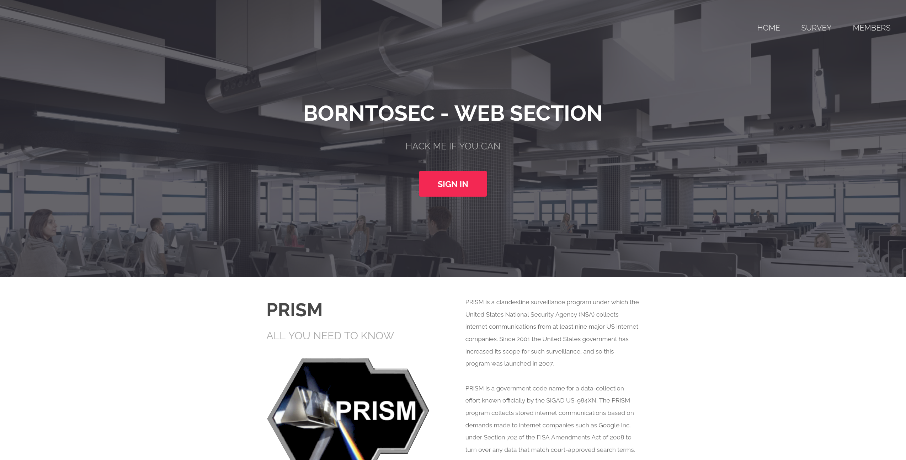

# Darkly
##### 42 Web Application related Security project
----


## Introduction
Darkly is one of the [42](https://42.fr/en/homepage/)'s security project related to `Web applications`, where you learn to exploit a **web application**. The project is similar to [OWASP-VWAD](https://owasp.org/www-project-vulnerable-web-applications-directory/).

We are given a Linux (ubuntu x32) [iso](https://mega.nz/file/6f4UEKBZ#iYNQUcUIr3nsCDvsSNm2-Nhpm76L-L4QdRfsGKx0VFA) containing a vulnerable web application and we are suppose to exploit it in different ways and obtain the [`flags`](https://startacybercareer.com/what-is-a-cybersecurity-capture-the-flag/).

## Resources

- Project [link](https://projects.intra.42.fr/projects/42cursus-darkly) for 42's students
- You can find the iso in the [42's server](https://projects.intra.42.fr/uploads/document/document/2439/Darkly_i386.iso) or in [Mega](https://mega.nz/file/6f4UEKBZ#iYNQUcUIr3nsCDvsSNm2-Nhpm76L-L4QdRfsGKx0VFA) (**Darkly_i386.iso**:`66d1a5d77c33a935ccb219b97f207b6a`)
- Subject [fr](https://cdn.intra.42.fr/pdf/pdf/15606/fr.subject.pdf) [fr_backup](/resources/subject/fr/fr.darkly.pdf)
- The video for this project in [Intra](https://elearning.intra.42.fr/notions/darkly/subnotions/darkly/videos/darkly) and in **RAW** format (for which no login is required) [HD](https://cdn.intra.42.fr/video/video/405/_projet__darkLy.mp4) [SD](https://cdn.intra.42.fr/video/video/405/low_d__projet__darkLy.mp4)

## Finding the flags and validating them

A sepcific file structure must be respected to validate project.
- We must create a directory for each vulnerability found.
  - The directory name must be the same as the **exploit** name or the **challenge** name.
  - The directory contains a file called `flag` that contains the **flag** for the particular challenge.
  - It also called a directory called `Ressources` which contains the **writeup** for the challenge and other stuffs to solve the challenge.
- The directory should not contain anything else.

!> Anything present in the `Ressources` directory **must** be clearly explained during the correction without any hasitation. No binary should be present in this directory.

### Exemple of project directory
```bash
$> ls -al
[..]
drwxr-xr-x 2 root root 4096 Dec 3 XX:XX {Name of the exploit}
drwxr-xr-x 2 root root 4096 Dec 3 XX:XX {Name of the exploit}
drwxr-xr-x 2 root root 4096 Dec 3 XX:XX {Name of the exploit}
[..]
$> ls -alR {Name of the exploit}
{Name of the exploit}:
total 16
drwxr-xr-x 3 root root 4096 Dec 3 15:22 .
drwxr-xr-x 6 root root 4096 Dec 3 15:20 ..
-rw-r--r-- 1 root root 5 Dec 3 15:22 flag
drwxr-xr-x 2 root root 4096 Dec 3 15:22 Ressources
{Name of the exploit}/Ressources:
total 8
drwxr-xr-x 2 root root 4096 Dec 3 15:22 .
drwxr-xr-x 3 root root 4096 Dec 3 15:22 ..
-rw-r--r-- 1 root root 0 Dec 3 15:22 whatever.wahtever
$> cat {Name of the exploit}/flag | cat -e
XXXXXXXXXXXXXXXXXXXXXXXXXXXX$
$>
```

## Get started with the project
To start the project just open the ISO in a virtual machine such as [**VMware**](https://www.vmware.com/) or [**VirtualBox**](https://www.virtualbox.org/) (or whatever you want)

!> If you are using Virtual Box, set your network option to bridge

according to the 42 subject all you need to do is
- Boot the iso
- Go to the ip address shown when you boot the iso (in the web server) and the port

### An exemple of the front page
