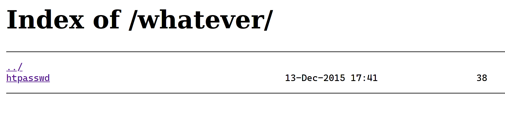
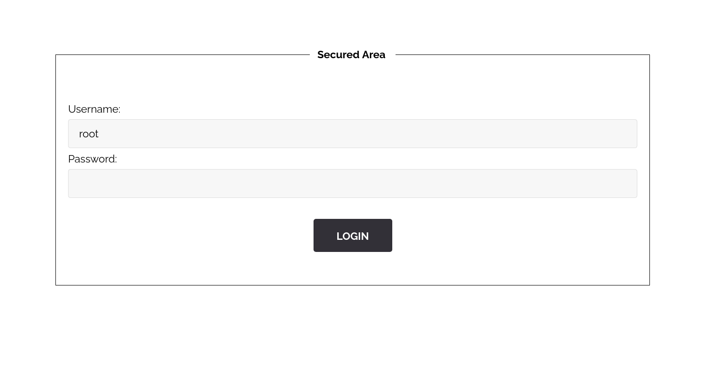

# htpassword

- Tags : `hash`, `md5`, `admin`, `.htpasswd`
- Server ip : `192.168.0.23 `
- Difficulty : <span style="color : green">Easy</span>
___


# problem

One of the first place to look for when we are searching for hidden stuffs in a **web application** is [`robots.txt`](https://en.wikipedia.org/wiki/Robots_exclusion_standard). This is a special file that is used to tell [`scrapping`](https://en.wikipedia.org/wiki/Web_scraping) softwares or **search engines** where to go and where not to go in the web site.

For me the server is running on http://192.168.0.23 (it might be different for you). When we go to http://192.168.1.23/robots.txt we get the following contents

```robots.txt
User-agent: *
Disallow: /whatever
Disallow: /.hidden
```

It says that all user agent (any browsers or software) should not go to the following directories

- `/whatever` (http://192.168.0.23/whatever/)
- `/.hidden`  (http://192.168.0.23/.hidden)

?> For this writeup what interest us is `/whatever`.

when we visit the path **http://192.168.0.23/whatever/** we can see the following content



There is a file called `htpasswd`.

We know from the [apache](https://httpd.apache.org/docs/2.4/programs/htpasswd.html) web page that `.htpasswd` is

>htpasswd is used to create and update the flat-files used to store usernames and password for basic authentication of HTTP users.

when we open the file we get the following data
```text
root:8621ffdbc5698829397d97767ac13db3
```

It looks like an user credential. In the homepage (http://192.168.0.23) we get the option to `SIGN IN`. when we try `root` as **Username** and `8621ffdbc5698829397d97767ac13db3` as **Password**, it says **Sorry wrong answer**. So we can not use them to log in.

# Solution
The data is separated using a `:`, the first part of the data is `root` and the second part is `8621ffdbc5698829397d97767ac13db3`. The second part look a lot like an md5 hash. We can also use [this](https://hashes.com/en/tools/hash_identifier) kind of online took to findout the type of the `hash`. We can easily decrypt this hash suing online tools such as [md5decrypt.net](https://md5decrypt.net/en/) or [www.md5online.org](https://www.md5online.org/md5-decrypt.html). And when we decrypt it we know the hash is of the word **`dragon`**. We can also verify it using the `cli` tool `md5sum on **Linux** or `md5` on MacOs (have no idea for windows)

```bash
echo -n "dragon" | md5sum ## The -n means no new line at the end
```

Now if we use the following as user credentials on our Sing In page

Username : `root`
Password : `dragon`

... It still doesn't works ...
hmm..
sh#t ?

Well by seeing the `username` we can guess this is an administrator account, so this is possible that we can not log in from a normal user portal.
In this kind of old application it is not uncommot to find the following directories
- /admin
- /image or /images
- /css
- /js
- etc...

Ofcorse we can easily discover basic culnerable paths using tools such as [`nmap`](https://nmap.org/) or [`dirbuster`](https://sourceforge.net/projects/dirbuster/files/DirBuster%20Source/1.0-RC1/)

##### Exemple of nmap
```bash
sudo nmap nmap --script=http-enum   192.168.0.23 
Starting Nmap 7.80 ( https://nmap.org ) at 2021-10-24 22:36 CEST
Failed to resolve "nmap".
Nmap scan report for 192.168.0.23
Host is up (0.00013s latency).
Not shown: 998 closed ports
PORT     STATE SERVICE
80/tcp   open  http
| http-enum: 
|   /admin/: Possible admin folder
|   /admin/index.php: Possible admin folder
|   /test.php: Test page
|_  /robots.txt: Robots file
4242/tcp open  vrml-multi-use
MAC Address: 08:00:27:CD:44:94 (Oracle VirtualBox virtual NIC)

Nmap done: 1 IP address (1 host up) scanned in 1.44 seconds
```

And this clearly shows that there is a directory called `/admin/`. When we try tto access the http://192.168.0.23/admin/ page, there is also a login form.


When we try our `root` user credential here, we get the following flag!

```text
The flag is : d19b4823e0d5600ceed56d5e896ef328d7a2b9e7ac7e80f4fcdb9b10bcb3e7ff
```


# How to avoid the problem
This file should be a hidden file and it's acess should be restricted using `.htaccess` or even better not have them in the first place!

# Flag

```text
d19b4823e0d5600ceed56d5e896ef328d7a2b9e7ac7e80f4fcdb9b10bcb3e7ff
```