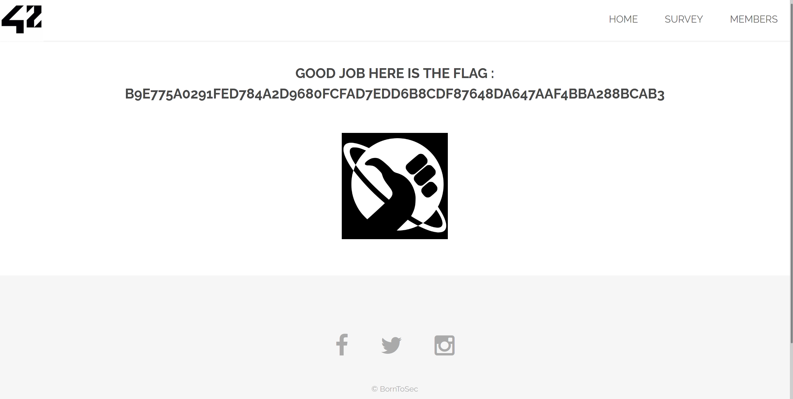

# <span style="text-decoration: underline">Redirection</span>

##### Tags : `url`, `redirection`, `query`
##### Server ip : `192.168.1.23 `
____

# <span style="text-decoration: underline">problem</span>
On the bottom of our home page (http://192.168.1.23/) we have 3 **Social media** icons as we can see in this image


Upon clicking the icons we are redirected to

|Icon|Redirected site|
|---|--|
|Facebook|https://www.facebook.com/42born2code/|
|Twitter|https://twitter.com/42born2code|
|Instagram|Instagram of 42|

When we inspect the source code for this icons we can see the following `html` code
```html
<ul class="icons">
	<li><a href="index.php?page=redirect&site=facebook" class="icon fa-facebook"></a></li>
	<li><a href="index.php?page=redirect&site=twitter" class="icon fa-twitter"></a></li>
	<li><a href="index.php?page=redirect&site=instagram" class="icon fa-instagram"></a></li>
</ul>
```

Here we can see that wr are not redirected directly to the social media page, **but** we are first redirected to a page called **`redirect`** with the parameter

|name|value|
|----|-----|
|site|facebook|

That means we first ask the server if it can redirect us to the proper link of the social media we are trying to access.

# <span style="text-decoration: underline">Solution</span>

We can simply take the redirection link and change the value of `site` field so that we can control where we are going. So an exemple would be the following

```text
http://192.168.1.23/index.php?page=redirect&site=42
```

And we get the following result



# How to avoid the problem
We should always verify query parameter on the server side and manage errors, because if the server do not verify a hacker could lead a user to a malicious site using our url which itself looks like a harmless ul but the result could be very different.

# Flag

```text
b9e775a0291fed784a2d9680fcfad7edd6b8cdf87648da647aaf4bba288bcab3
```
